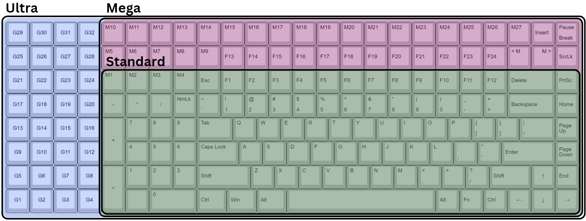

To use these files, go to http://www.keyboard-layout-editor.com/ and paste the data in the "Raw Data" area to load in the layout.  
## Variants
This project started with just the Standard layout which is most similar to a "100%" office keyboard but with the compact southpaw modifications.  One other change is I put the tall numberpad keys (enter and plus) on the outer side to be used by the left pinkie finger, just as the right pinkie uses these on a standard layout.  
Later, I added the Mega layout to fill some vertical space, as otherwise it seemed a little short in the vertical axis since it lacks the space between the number row and the F keys.  This also lets you get F13-24 which is rare on a current keyboard.  
Finally, I looked at my old Corsair K95 RGB and remembered how much I used those extra macro keys, so I made the Ultra layout which is pushing the boundaries of good taste, as well as the pin counts on most microcontrollers.  
Frankly, if you're here, you're probably here for the Ultra, and as time goes on I may recreate the Standard and Mega versions by cutting down the Ultra boards, but it's not a priority.  
### Comparison of layouts:  

